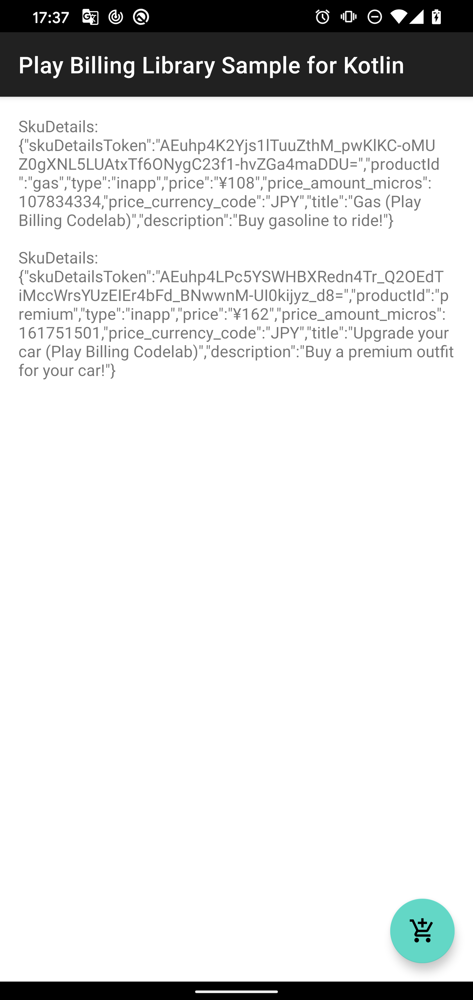

# Play Billing Library 3.0 Sample for Kotlin

Play Billing Library 3.0 sample

[Google Play Billing Library release notes](https://developer.android.com/google/play/billing/release-notes)

"billing_codelab_signature.jks" is from Google Devloper Codelabs and exposed for testing purpose only.

<table>
<tr>
<td></td>
<td></td>
</tr>
</table>
